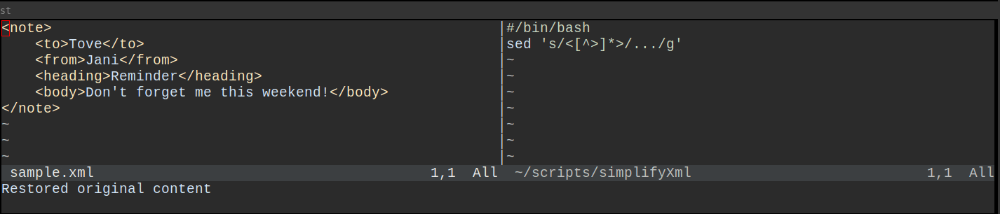

# nvim-inplace-preview

A Neovim plugin that shows transformed/processed versions of your code in-place using external tools. Perfect for previewing simplified code, formatted output, compiled results, or any other transformation.

## Example

- Define a transformer script. Say we replace xml tags with "..." by `sed 's/<[^>]*>/.../g'`
- Define this script as your `preview_cmd`
- Press `<leader>p` to toggle between original and transformed content view:



## Installation

### Using vim-plug

Add to your `init.vim`:

```vim
Plug 'kareltucek/nvim-inplace-preview'
```

Then run `:PlugInstall`

## Configuration

### Simple Configuration

```vim
" Configure the plugin in your init.vim
lua << EOF
require('inplace-preview').setup({
    preview_cmd = 'python3 ~/.config/nvim/simplify.py',
    toggle_key = '<leader>p',
})
EOF
```

### Per-Filetype Configuration

```vim
" Method 1: Using autocmds (recommended)
augroup InplacePreviewConfig
    autocmd!
    autocmd FileType python lua require('inplace-preview').setup({preview_cmd = 'python3 ~/.config/nvim/simplify-python.py'})
    autocmd FileType javascript lua require('inplace-preview').setup({preview_cmd = 'node ~/.config/nvim/simplify-js.js'})
    autocmd FileType markdown lua require('inplace-preview').setup({preview_cmd = 'pandoc -f markdown -t html'})
    autocmd FileType json lua require('inplace-preview').setup({preview_cmd = 'jq .'})
    autocmd FileType lua lua require('inplace-preview').setup({preview_cmd = 'lua ~/.config/nvim/simplify-lua.lua'})
augroup END
```

## Usage

- Press `<leader>p` (or your configured key) to toggle preview
- Use `:InplacePreviewToggle` command
- When in preview mode, buffer becomes read-only
- Toggle again to restore original content

## Commands

- `:InplacePreviewToggle` - Toggle between original and preview
- `:InplacePreviewShow` - Show preview
- `:InplacePreviewHide` - Restore original content

## Statusline Integration

Add to your statusline to show when preview is active:

```vim
set statusline+=%{InplacePreviewStatus()}
```
## Configuration Options

- `preview_cmd` (string): Command to transform your code (default: `"cat"`)
- `toggle_key` (string): Key binding to toggle preview (default: `"<leader>p"`, set to `""` to disable)

## Example transformer

Replaces xml tag content with spaces of the same length:

```
#/bin/bash
pattern='"<".(" " x ($len - 2) . ">")'

perl -pe '
BEGIN {
    @regexes = (
        qr/<[^>]*>/,
    );
}
for my $regex (@regexes) {
    my $a = 0;
    while (/$regex/ and $a < 10) {
        my $match = $&;
        my $len = length($match);
        if ($len > 0) {
            my $repl = '"$pattern"';
            s/\Q$match\E/$repl/g;
        }
        $a++;
    }
}
'
```

## Troubleshooting

### Preview command not working

Test your command manually:

```bash
echo "test content" | your-preview-command
```
### No output from preview

Check if your command:
1. Reads from stdin
2. Writes to stdout
3. Has proper permissions (for scripts)

### Plugin not loading

Make sure you have:
1. Neovim 0.5+
2. Called `require('inplace-preview').setup()` in your config
3. Restarted Neovim after installation

## Requirements

- Neovim 0.5+
- External transformation tool (configured via `preview_cmd`)

## License

MIT

